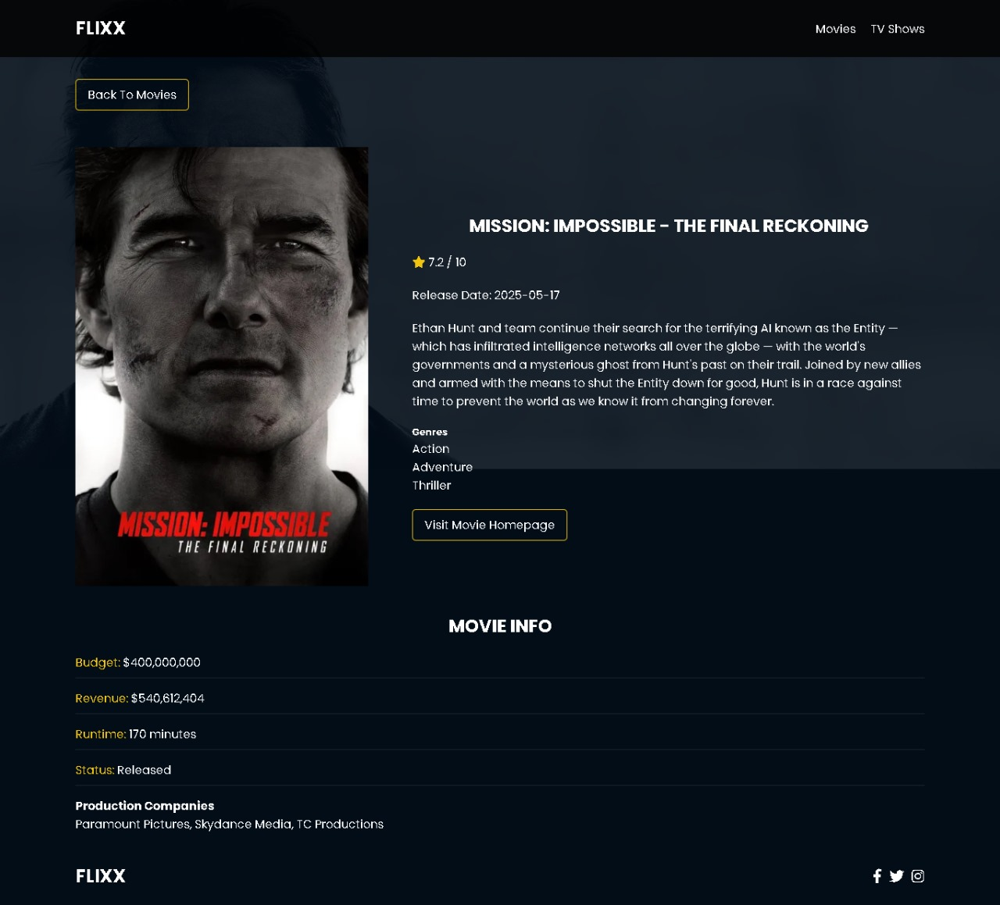

# Flixx-App

Flixx is a movie and TV show discovery app built using HTML, CSS, and JavaScript. It integrates with the TMDB API to fetch and display trending movies, popular TV shows, detailed media pages, and a real-time search feature — all with a responsive UI and dynamic routing.

## Home Page


## Movie Review



---

## Features

- Browse trending **movies and TV shows**
- Swiper-powered **"Now Playing" slider** (currently in theaters)
- Detailed pages with overviews, ratings, genres, and release dates
- Full-featured **search** with **pagination**
- **Responsive design** optimized for all screen sizes

---

## Technologies Used

- **HTML5** – Semantic and accessible markup
- **CSS3** – Responsive and modern styling
- **JavaScript (Vanilla)** – App logic and dynamic content rendering
- **TMDB API** - Open-source API for movie and TV data
- **Swiper.js** - Modern carousel library for the slider
    
---    

## Live Demo

[Check out the live website here](https://flixx-moviereviews-webapp.netlify.app/)

---

## Getting Started

### 1. Clone the Repository

```bash
git clone https://github.com/SumitDesai-21/flixx-app.git
cd flixx-app  
```

### 2. Get a Free TMDB API Key

Visit TMDB API Settings
Create an account and generate a new API key.

### 3. Add Your API Key

Open the myscript.js file and Add your API key.

### 4. Run the App

You can open index.html in your browser or use a local server
(like Live Server in VS Code).

---
## About the Author
 - **LinkedIn**: [Sumit Desai](https://linkedin.com/in/sumit-v-d-3b6a9632a)
 - **GitHub**: [Sumit Desai](https://github.com/SumitDesai-21)
 
Happy Coding! :heart:
